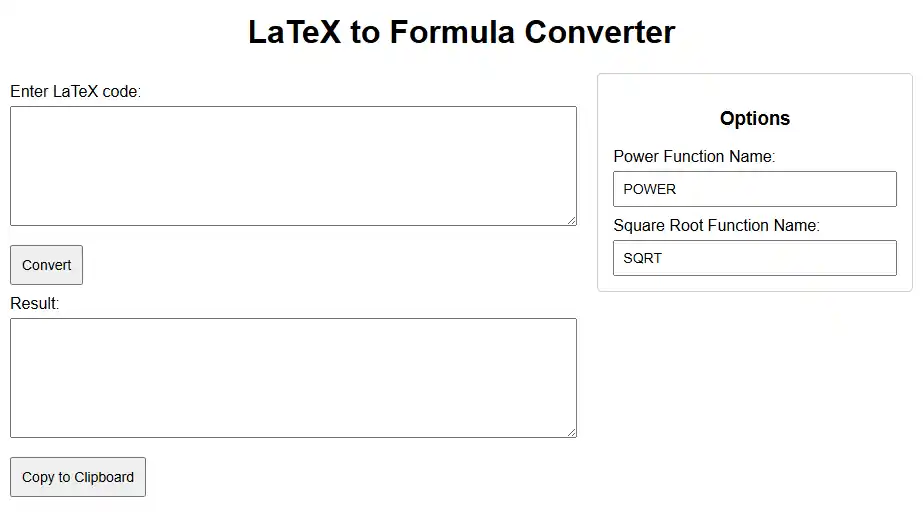

# LaTeX2FormulaWeb

[latex2formula.krzsztf.com](https://latex2formula.krzsztf.com/)

*See also: [LaTeX2Formula Python version](https://github.com/krzsztfwtk/LaTeX2Formula)*

html, css, js app to convert LaTeX math expressions into formula code for SQL, Excel, C++, etc.

Simply paste LaTeX expression and instantly obtain formula code. You can customize function names (`POWER`, `SQRT`).
